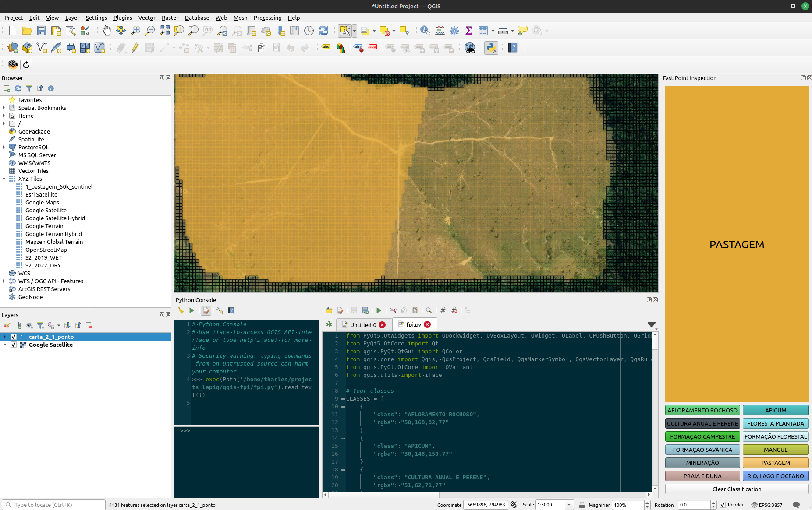
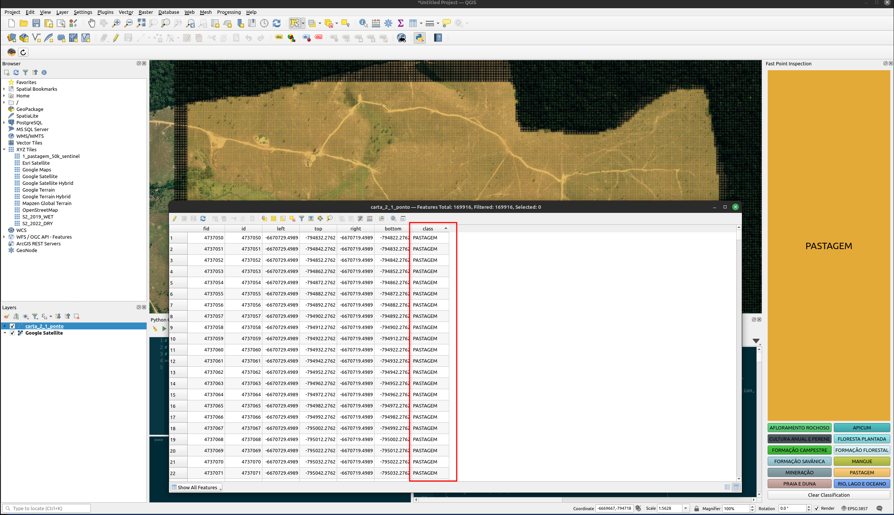

# Fast Point Inspection for QGIS (FPI)

Fast Point Inspection is a QGIS plugin that streamlines the process of classifying point geometries in a layer. It provides a user-friendly dock widget containing buttons for each class type. Users can select features and then classify them by clicking on these buttons.




## Features
- Simple interface integrated into QGIS.
- Batch classification of selected point features.
- Easy to customize classes and their colors.
- "Clear Classification" button to reset classification.

## Installation
### Prerequisites
Make sure you have QGIS installed on your system.

### Install via Python Console
1. Open QGIS.
2. Open the Python Console (`Plugins -> Python Console` or press `Ctrl+Alt+P`).
3. Go to the `Show Editor` tab.
4. Copy-paste the script `fpi.py` into the editor and run it.

## Usage
1. Once installed, the dock widget should appear on the right-hand side of the QGIS window.
2. Select a layer containing point features.
3. Select the features you want to classify.
4. Click on the class buttons to set the class for the selected features.
5. Use the "Clear Classification" button to reset the class attribute to NULL for selected features.


### Defining Your Own Classes
You can define your own classes by modifying the `CLASSES` list in the Python script `fpi.py`. Each class is represented as a dictionary with the following key-value pairs:

- `class`: The name of the class. It should be a string.
- `rgba`: The color associated with the class, in the format `R,G,B,A` where each value is an integer between 0 and 255.

Here's an example:

```python
CLASSES = [
    {
        "class": "AFLORAMENTO ROCHOSO",
        "rgba": "50,168,82,77"
    },
    {
        "class": "PASTAGEM",
        "rgba": "30,148,150,77"
    }
]
```


## Contributing
Pull requests are welcome. For major changes, please open an issue first to discuss what you would like to change.

## License
MIT License. See `LICENSE` for more information.
